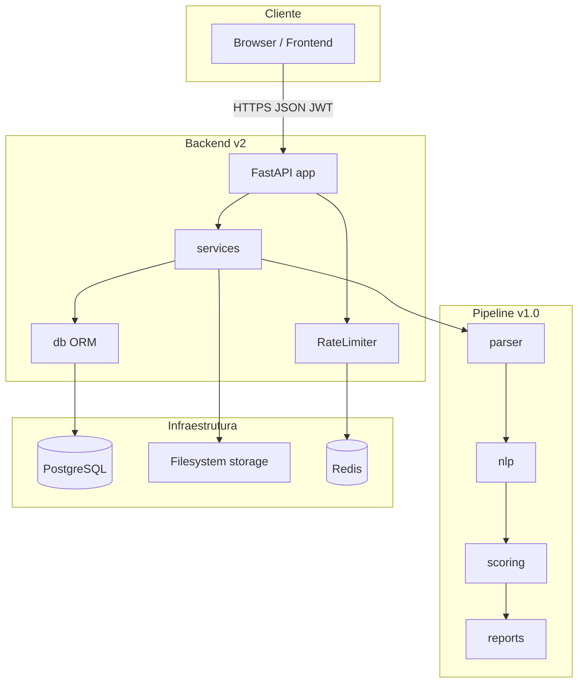
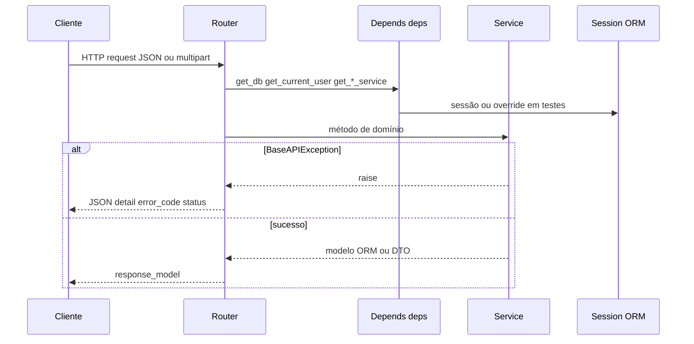
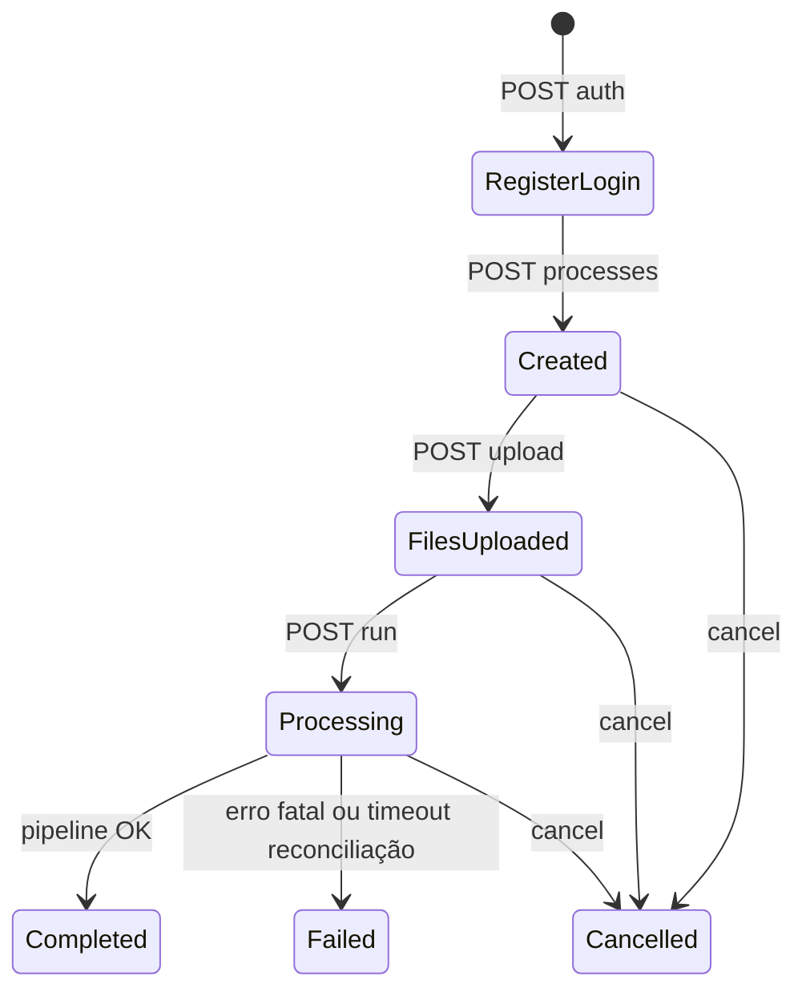

# Automated Resume Screener — Arquitectura (Backend v2.0)

**Versão:** 2.0 (em evolução)  
**Estado:** Pipeline v1.0 estável; API FastAPI operacional com autenticação JWT, processos multi-utilizador e screening em background.  
**Última actualização:** Maio 2026  
**Autor:** Leandro Alves  

**Documentação relacionada:** o registo cronológico das alterações ao código (health check, handlers, router `results`, máquina de estados, reconciliação, erros HTTP, testes) está em [`BACKEND_REFACTOR_ADJUSTMENTS.md`](BACKEND_REFACTOR_ADJUSTMENTS.md). Este documento descreve a **arquitectura alvo e o fluxo actual**; não substitui essa lista de commits/refactorações.

---

## Índice

1. [Resumo executivo](#1-resumo-executivo)
2. [Objectivos e fora de âmbito](#2-objectivos-e-fora-de-âmbito)
3. [Contexto do sistema](#3-contexto-do-sistema)
4. [Arquitectura do pipeline v1.0](#4-arquitectura-do-pipeline-v10)
5. [Arquitectura v2.0 — API FastAPI](#5-arquitectura-v20--api-fastapi)
6. [Fluxo de pedido HTTP (backend)](#6-fluxo-de-pedido-http-backend)
7. [Fluxo de negócio: processo, upload, screening, resultados](#7-fluxo-de-negócio-processo-upload-screening-resultados)
8. [Decisões de arquitectura (ADRs)](#8-decisões-de-arquitectura-adrs)
9. [Camadas da aplicação](#9-camadas-da-aplicação)
10. [Modelo de dados (resumo)](#10-modelo-de-dados-resumo)
11. [Estados do processo e transições](#11-estados-do-processo-e-transições)
12. [API REST — visão geral](#12-api-rest--visão-geral)
13. [Erros HTTP e contrato JSON](#13-erros-http-e-contrato-json)
14. [Armazenamento de ficheiros](#14-armazenamento-de-ficheiros)
15. [Segurança e privacidade (resumo)](#15-segurança-e-privacidade-resumo)
16. [Observabilidade](#16-observabilidade)
17. [Estratégia de testes](#17-estratégia-de-testes)
18. [Deploy (visão)](#18-deploy-visão)
19. [Riscos e trabalho futuro](#19-riscos-e-trabalho-futuro)

---

## 1. Resumo executivo

O **Automated Resume Screener (ARS)** automatiza o triagem inicial de CVs face a uma descrição de vaga, usando NLP e um motor de pontuação multi-critério.

- **v1.0:** pipeline CLI completo e testado: parsing (PDF, DOCX, TXT), extracção de features, scoring (TF-IDF + critérios ponderados), relatórios CSV/JSON/TXT. O pacote `backend/` (fora de `backend/api/`) é tratado como **biblioteca interna** — não deve ser alterado para satisfazer a API; a API **orquestra** chamadas a esse código.
- **v2.0:** camada **FastAPI** (`backend/api/`), base de dados relacional, utilizadores com **JWT** (access + refresh), processos com **owner**, uploads, `BackgroundTasks` para screening, export de relatórios e health check.

---

## 2. Objectivos e fora de âmbito

### Objectivos

- Expor o pipeline v1.0 via REST com persistência de processos, candidatos e resultados.
- Suportar PDF, DOCX e TXT com validação de extensão e MIME (`python-magic`).
- Contrato de erros estável: JSON com `detail` e `error_code` para erros de domínio.
- Fundação para evoluções (multi-idioma, filas duráveis, ATS).

### Fora de âmbito (exemplos)

- Colaboração em tempo real entre recrutadores.
- Integrações ATS directas (planeado para fases posteriores).
- Matching semântico com sentence-transformers (v2.1+).
- Aplicação móvel nativa.

---

## 3. Contexto do sistema



**Dependências externas de runtime:**
- Modelo **spaCy** configurado em `Settings` (ex.: `en_core_web_sm`), carregado no **lifespan** e disponível em `app.state.nlp_model` via dependência `get_nlp_model`.
- **Redis** para rate limiting: configurado em `REDIS_URL`, acedido por `RateLimiterService` com fail-open/fail-closed strategy (ver secção 15.5).

---

## 4. Arquitectura do pipeline v1.0

### Padrão

**Pipeline em cadeia:** cada etapa transforma dados e passa ao seguinte. Configuração central em `backend/config.py` (v1.0). O `ScreeningService` importa parsers, preprocessor, extractor, scorer e utilitários do v1.0 sem modificar esses módulos.

### Ordem típica (CLI v1.0)

1. Carregar modelo spaCy  
2. `JobDescriptionParser` → critérios da JD  
3. `ResumeParser` → texto por CV  
4. Por CV: preprocessamento → extracção de features → `ResumeScorer.score` → ordenação e relatório  

### Critérios de scoring (v1.0)

Pesos e etiquetas de categoria partilhados com a API via [`backend/api/scoring_config.py`](../backend/api/scoring_config.py) (`MATCH_CATEGORIES`) para que o **resumo** da API (`strong_matches`, etc.) coincida com as categorias produzidas pelo scorer (ver refactor em [`BACKEND_REFACTOR_ADJUSTMENTS.md`](BACKEND_REFACTOR_ADJUSTMENTS.md)).

---

## 5. Arquitectura v2.0 — API FastAPI

### Visão em camadas

```
HTTP
  → routes/     (auth, processes, upload, results)
  → deps.py     (factories: serviços, NLP, validação de UUID)
  → services/   (Auth, Process, Candidate, Screening, Report)
  → db/         (SQLAlchemy, sessão, modelos)
  → PostgreSQL + filesystem (CVs)
        +
  backend/      (pipeline v1.0 — só leitura / reutilização)
```

### Stack (referência)

| Componente | Tecnologia |
|-----------|------------|
| Framework | FastAPI |
| ORM | SQLAlchemy 2.x |
| Validação API | Pydantic v2 |
| Auth | JWT (access + refresh), Argon2 para passwords |
| NLP | spaCy (en_core_web_sm por defecto) |
| Cache/Rate Limiting | Redis 6.0+, redis[asyncio] 4.3+ |
| Validação MIME | python-magic |
| Testes | pytest, TestClient (httpx), SQLite in-memory nos testes automatizados |

**Nota:** a documentação histórica pode referir PostgreSQL em todos os ambientes; os **testes** em `backend/api/tests` usam tipicamente **SQLite :memory:** via [`conftest.py`](../backend/api/tests/conftest.py), com `PRAGMA foreign_keys=ON`.

---

## 6. Fluxo de pedido HTTP (backend)



- Rotas **não** contêm lógica de negócio: delegam em serviços.
- Excepções de domínio (`BaseAPIException` e subclasses) são convertidas pelo **único** `api_exception_handler` em [`main.py`](../backend/api/main.py) (ver refactor: handlers unificados em [`BACKEND_REFACTOR_ADJUSTMENTS.md`](BACKEND_REFACTOR_ADJUSTMENTS.md)).

---

## 7. Fluxo de negócio: processo, upload, screening, resultados

### 7.1 Visão linear (recrutador autenticado)



1. **Registo / login** — `POST /api/auth/register`, `POST /api/auth/login`; obter `Authorization: Bearer <access_token>`.
2. **Criar processo** — `POST /api/processes` com `title` e `jd_text` (mínimo de caracteres definido no schema); estado inicial **`created`**; `owner_id` = utilizador actual.
3. **Upload** — `POST /api/processes/{id}/upload` (multipart); `CandidateService` valida ficheiros, grava em `storage/processes/{id}/uploads/`, cria linhas `Candidate`; processo passa a **`files_uploaded`** quando aplicável.
4. **Correr screening** — `POST /api/processes/{id}/run` valida estado (`files_uploaded`), agenda **`BackgroundTasks`** com o runner que invoca `ScreeningService.run`, que faz `mark_processing`, processa cada candidato (commits intermédios conforme implementação), `mark_completed` ou `mark_failed`.
5. **Consultar resultados** — `GET /api/processes/{id}/results` agrega resultados (query partilhada [`results_query.py`](../backend/api/services/results_query.py)).
6. **Export** — `GET .../export/csv|json|txt` (processo tipicamente **`completed`**).

### 7.2 Comportamentos críticos (pós-refactor)

Documentação detalhada item a item: [`BACKEND_REFACTOR_ADJUSTMENTS.md`](BACKEND_REFACTOR_ADJUSTMENTS.md). Resumo:

| Tema | Comportamento |
|------|----------------|
| Router `results` | Montado em `main.py` (`include_router(results.router)`); sem isto, `/run` e `/results` seriam 404. |
| `POST /run` com estado errado | Resposta **`409 Conflict`** com mensagem clara se o processo não está em `files_uploaded` (detalhe legível no `ConflictError`). |
| Reentrada em `processing` | `ScreeningService.run` com processo já em **`processing`**: retorno **idempotente** (log + return) para evitar corrida entre workers. |
| Outros estados inesperados no `run` | Ex.: `CREATED` / `COMPLETED` → **`ConflictError`**. |
| Erro fatal no pipeline | Mensagem persistida no processo **genérica**; detalhe técnico só em **logs** (`logger.exception`). |
| Erros por candidato | `ProcessingError` com mensagem sanitizada; sem vazar PII do CV na BD. |
| Falhas de BD nos serviços | Mapeamento de `SQLAlchemyError` para **`InternalServerError` (500)**, não 400. |
| Processos presos em `processing` | No **startup**, `reconcile_stuck_processes(timeout)` marca como **`failed`** processos com `updated_at` antigo; configurável (`STUCK_PROCESS_TIMEOUT_MINUTES`). |
| `ForbiddenError` | Propagação correcta como **403** nas rotas de processos e resultados (não 400/500 por `except Exception` genérico). |
| NLP indisponível na dependência | `SpacyModelError` (contrato JSON), não `RuntimeError` sem formato. |

### 7.3 `missing_skills` na API

O modelo ORM **`Result`** guarda `matched_skills` e **`required_skills`**; **não** existe coluna `missing_skills`. O API deriva skills em falta com **`compute_missing_skills(result)`** em [`results_query.py`](../backend/api/services/results_query.py) (e consumidores alinhados: screening, relatórios).

---

## 8. Decisões de arquitectura (ADRs)

### ADR-01 — Pipeline v1.0 isolado

**Aceite.** O pacote de pipeline não é alterado para a API; `ScreeningService` importa e orquestra.

### ADR-02 — PostgreSQL em produção / desenvolvimento típico

**Aceite** para ambientes reais. Testes automatizados podem usar SQLite in-memory (ver `conftest.py`).

### ADR-03 — FastAPI

**Aceite.** OpenAPI nativo, Pydantic v2, dependências injectáveis.

### ADR-04 — ORM e schemas Pydantic separados

**Aceite.** Mapeamento explícito (ex.: `ProcessResponse.from_orm_process`).

### ADR-05 — Autenticação (actualização em relação a fases antigas)

**Estado actual:** **JWT implementado** — registo, login, refresh, logout, `get_current_user` nas rotas protegidas. O documento histórico em `Downloads/ARCHITECTURE.md` referia “sem auth na Fase 1”; na base de código actual, **as rotas de negócio exigem utilizador autenticado** onde aplicável. Deploy público continua a exigir `JWT_SECRET_KEY` forte e HTTPS.

### ADR-06 — CVs no filesystem (Fase 1)

**Aceite.** Caminho sob `storage/processes/{process_id}/uploads/`; metadados na tabela `candidates`.

### ADR-07 — BackgroundTasks para screening

**Aceite.** `POST /run` responde após validação; o trabalho pesado corre na mesma instância. **Limitação:** não sobrevive a restart; por isso existe **reconciliação** de processos órfãos no startup (ver secção 7.2).

### ADR-08 — Reservado (documentação histórica)

### ADR-09 — Redis para Rate Limiting

**Status:** Aceite (implementado em Phase 2).

**Contexto:** Endpoints críticos (`POST /auth/login`, `POST /auth/register`, `POST /upload`) são alvos de brute-force attacks. Precisamos de um mecanismo de rate limiting centralizado e configurável.

**Decisão:** Usar **Redis** como data store para contadores de rate limit com TTL automático. Implementar **estratégia fail-open/fail-closed** quando Redis fica indisponível.

**Consequências:**
- **Benefícios:**
  - Rate limiting distribuído (futuro multi-instance).
  - Configuração flexível por endpoint e janela de tempo.
  - Redis tem expiração automática (TTL), elimina limpeza manual.
- **Tradeoffs:**
  - Redis é um serviço externo (ponto único de falha se fail-closed).
  - Fail-open reduz segurança quando Redis cai, mas aumenta disponibilidade.
  - Requer variáveis de ambiente para configuração dos limites.
  
**Configuração (ver secção 15.5 e PROJECT_STRUCTURE.md):**
- `REDIS_URL` — conexão ao Redis.
- `RATE_LIMIT_FAIL_OPEN` — comportamento quando Redis indisponível.
- `RATE_LIMIT_*_REQUESTS` e `RATE_LIMIT_*_WINDOW_SECONDS` — limites por endpoint.

---

## 9. Camadas da aplicação

### Serviços (contratos principais)

| Serviço | Responsabilidade |
|---------|------------------|
| **AuthService** | Registo, login, refresh, blacklist/revogação, `get_current_user`. |
| **ProcessService** | CRUD de processos, máquina de estados, `mark_*`, **`reconcile_stuck_processes`**. |
| **CandidateService** | Validação de upload, gravação em disco, CRUD de candidatos, ownership. |
| **ScreeningService** | Orquestração do pipeline v1.0 por candidato, persistência de `Result` / `ProcessingError`, transições de estado do processo. |
| **ReportService** | Export CSV/JSON/TXT a partir da BD com validação de ownership e estado. |
| **RateLimiterService** | Rate limiting baseado em Redis com estratégias fail-open/fail-closed; limites configuráveis por endpoint (login, register, upload). |

### Utilitários de Aplicação

| Componente | Localização | Responsabilidade |
|-----------|-------------|------------------|
| **Dependencies Factory** | `api/routes/deps.py` | Factories FastAPI `Depends()`: `get_db`, `get_current_user`, serviços, `get_nlp_model`, validação de UUIDs. |
| **Query Optimization** | `api/services/results_query.py` | Queries otimizadas (N+1 fix) para aggregação de resultados, missing skills calculation. |
| **File Validators** | `api/utils/validators.py` | Validação de extensão, MIME type (python-magic), tamanho, sanitização de nomes. |

### Rotas

| Router | Prefixo | Conteúdo principal |
|--------|---------|-------------------|
| `auth` | `/api/auth` | register, login, refresh, logout |
| `processes` | `/api/processes` | criar, listar, obter por id |
| `upload` | `/api/processes` | `POST .../upload` |
| `results` | `/api/processes` | `POST .../run`, `GET .../results`, `GET .../export/*` |

### Dependências partilhadas

[`backend/api/routes/deps.py`](../backend/api/routes/deps.py): fábricas de `ProcessService`, `CandidateService`, `ScreeningService`, `ReportService`, `get_nlp_model`, validação de `process_id`.

---

## 10. Modelo de dados (resumo)

- **User** — credenciais, papel (`recruiter` / `admin`).
- **Process** — `title`, `jd_text`, `status`, `owner_id`, timestamps, `error_message`.
- **Candidate** — ligado a `process_id`, ficheiro, `raw_text`, `parse_status`.
- **Result** — `candidate_id`, `total_score`, `category`, `breakdown`, `matched_skills`, **`required_skills`**, `experience_years_found`.
- **ProcessingError** — erros por etapa (`stage`, `message` sanitizada).
- **RefreshToken** (e estruturas associadas na auth) — sessões refresh.

Relações: `Process (1) —< (N) Candidate (1) — (1) Result`; processo tem muitos `ProcessingError`.

---

## 11. Estados do processo e transições

Valores canónicos em string alinhados com enum (`created`, `files_uploaded`, `processing`, `completed`, `failed`, **`cancelled`** com duplo **l** — correcção de schema vs ORM documentada em [`BACKEND_REFACTOR_ADJUSTMENTS.md`](BACKEND_REFACTOR_ADJUSTMENTS.md)).

Regras de transição validadas em **`ProcessService.update_status`**; transições inválidas → **`ConflictError` (409)**.

---

## 12. API REST — visão geral

- **`POST /api/processes`** — criar processo (autenticado).
- **`GET /api/processes`** — listar (paginação conforme implementação).
- **`GET /api/processes/{id}`** — detalhe; **403** se não for o owner.
- **`POST /api/processes/{id}/upload`** — multipart.
- **`POST /api/processes/{id}/run`** — inicia screening em background.
- **`GET /api/processes/{id}/results`** — estado + candidatos rankeados quando aplicável.
- **`GET /api/processes/{id}/export/{csv,json,txt}`** — streams de export.
- **`GET /health`** — sem auth; `database`, `nlp_model`, `environment` (não está sob `/api`).

Contratos exactos: OpenAPI em `/docs`.

---

## 13. Erros HTTP e contrato JSON

Para todas as excepções que herdam **`BaseAPIException`**:

```json
{
  "detail": "mensagem legível",
  "error_code": "CODIGO_ESTÁVEL"
}
```

O `status_code` HTTP vem da excepção (400, 401, 403, 404, 409, 500, …). Erros de validação Pydantic usam o formato padrão FastAPI **422** com `detail` em lista de erros.

---

## 14. Armazenamento de ficheiros

- Directório configurável (`storage_path` em `Settings`).
- Nomes seguros: UUID + nome original sanitizado.
- Validação: extensão (`SUPPORTED_EXTENSIONS`) + **MIME real** (`python-magic`).
- Limite de tamanho (ex.: 10 MB) — ver `validators.py` / `config.py`.

---

## 15. Segurança e privacidade (resumo)

### 15.1 Validação de ficheiros
- Não confiar no header `Content-Type` do cliente para o tipo real do ficheiro.
- Usar `python-magic` para detectar MIME type real baseado em magic bytes.
- Validar extensão contra whitelist (`SUPPORTED_EXTENSIONS`).

### 15.2 Proteção de PII
- `raw_text` e PII: não expor em respostas públicas.
- Logs sem texto integral de CV (política alinhada com mensagens de erro sanitizadas na BD).
- Sanitizar nomes de ficheiros para prevenir path traversal attacks.

### 15.3 Autenticação e tokens
- JWT: segredo forte em produção; validação de placeholders em `config` (ver refactor).
- Access tokens com TTL curto (ex.: 30 minutos).
- Refresh tokens com TTL longo (ex.: 7 dias).

### 15.4 Headers de segurança
- Middleware global adiciona `X-Content-Type-Options: nosniff`, `X-Frame-Options: DENY`, `Referrer-Policy: same-origin`.
- CORS configurável por origem (whitelist em `ALLOWED_ORIGINS`).

### 15.5 Rate Limiting
- **Objetivo:** prevenir brute-force attacks em endpoints críticos (auth, upload).
- **Implementação:** Redis-based com contadores com TTL.
- **Client Identity:** IP do cliente ou header `X-Forwarded-For` (quando atrás de proxy).
- **Estratégia fail-open/fail-closed:**
  - **Fail-open** (default): Redis indisponível → permitir request, registar warning (menor segurança, maior disponibilidade).
  - **Fail-closed**: Redis indisponível → rejeitar com 429, registar erro (maior segurança, menor disponibilidade).
- **Limites por endpoint** (configuráveis):
  - Login: 5 tentativas por 15 minutos (ou `RATE_LIMIT_LOGIN_REQUESTS` / `RATE_LIMIT_LOGIN_WINDOW_SECONDS`).
  - Register: 3 tentativas por 15 minutos.
  - Upload: 10 tentativas por 5 minutos.
- **Variáveis de ambiente:**
  ```
  REDIS_URL=redis://localhost:6379
  RATE_LIMIT_ENABLED=true
  RATE_LIMIT_FAIL_OPEN=true
  RATE_LIMIT_LOGIN_REQUESTS=5
  RATE_LIMIT_LOGIN_WINDOW_SECONDS=900
  RATE_LIMIT_REGISTER_REQUESTS=3
  RATE_LIMIT_REGISTER_WINDOW_SECONDS=900
  RATE_LIMIT_UPLOAD_REQUESTS=10
  RATE_LIMIT_UPLOAD_WINDOW_SECONDS=300
  ```

---

## 16. Observabilidade

- Logging estruturado com `request_id` (middleware de logging, conforme `utils/logging.py`).
- Health check para liveness e verificação de BD / estado do modelo NLP em `app.state`.
- Reconciliação de processos órfãos registada em log no startup.

---

## 17. Estratégia de testes

- **Unitários:** `backend/api/tests/unit/services/` — serviços com SQLite in-memory.
- **Integração HTTP:** `backend/api/tests/integration/routes/` — `TestClient`, override de `get_nlp_model` em [`integration/routes/conftest.py`](../backend/api/tests/integration/routes/conftest.py) (lifespan não corre no cliente de teste).
- **Testes de Rate Limiting:**
  - Redis indisponível + fail-open → requests permitidos.
  - Redis indisponível + fail-closed → requests rejeitados com 429.
  - Exceder limite em login → 429 após 5 tentativas.
  - Exceder limite em upload → 429 após 10 tentativas.
  - Reset de limite após expiração de janela.
  - (Usar `fakeredis` ou mock de Redis em testes de unidade; testes de integração com Redis real ou `testcontainers`.)
- Inventário, cobertura e **roadmap** (upload HTTP, lista de processos, refresh, export, `validators` unit): [`TESTING.md`](TESTING.md).
- Contagem actual da suite: ver `pytest backend/api/tests/ --collect-only` (referência recente: **80+** testes).

---

## 18. Deploy (visão)

- ASGI: uvicorn (ou equivalente) a servir `backend.api.main:app`.
- Variáveis: `DATABASE_URL`, `JWT_SECRET_KEY`, modelo spaCy, `STUCK_PROCESS_TIMEOUT_MINUTES`, CORS, etc.
- **Produção:** `create_tables()` no lifespan está **desactivado**; usar **Alembic** para schema (ver [`BACKEND_REFACTOR_ADJUSTMENTS.md`](BACKEND_REFACTOR_ADJUSTMENTS.md)).

---

## 19. Riscos e trabalho futuro

| Risco / tema | Nota |
|--------------|------|
| BackgroundTasks não durável | Restart durante `processing` pode deixar estado inconsistente até à reconciliação no próximo startup ou timeout. |
| Fila externa | Celery/RQ + broker para retries e isolamento (evolução natural após ADR-07). |
| Redis indisponível | Se `RATE_LIMIT_FAIL_OPEN=false`, requests são rejeitados com 429 quando Redis cai (menor disponibilidade). Se `fail-open=true`, taxa de ataques brute-force aumenta (menor segurança). Mitigation: monitorar Redis uptime, alertas, failover strategy. |
| Redis memory exhaustion | Contadores acumulam em memória; sem política de expiração, Redis fica cheio. Mitigation: usar `maxmemory-policy=allkeys-lru` no Redis (ver deploy docs). |
| Distribuído rate limiting | Com múltiplas instâncias, cada uma conecta a Redis; contadores são centralizados (OK). Porém, se Redis partition ocorre, alguma instância pode ficar offline. Mitigation: Redis Sentinel ou Cluster. |
| Cobertura de rotas | Export e upload multipart beneficiam de mais testes de integração (ver `TESTING.md`). Rate limiting tests (ver secção 17). |
| ADR históricos | Documentos antigos podem assumir “sem auth” ou `GET /api/health` — a implementação actual segue este ficheiro e `BACKEND_REFACTOR_ADJUSTMENTS.md`. |

---

*Documento baseado na estrutura do ficheiro de referência `ARCHITECTURE.md` (v2.0, Abril 2026) e actualizado para reflectir o código e as cinco rondas de refactor documentadas em [`BACKEND_REFACTOR_ADJUSTMENTS.md`](BACKEND_REFACTOR_ADJUSTMENTS.md).*
